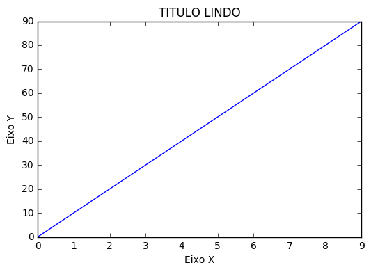
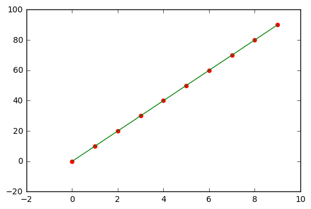
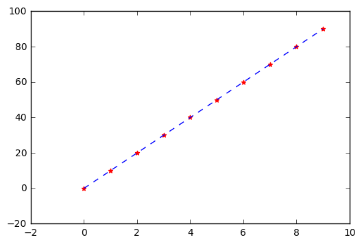
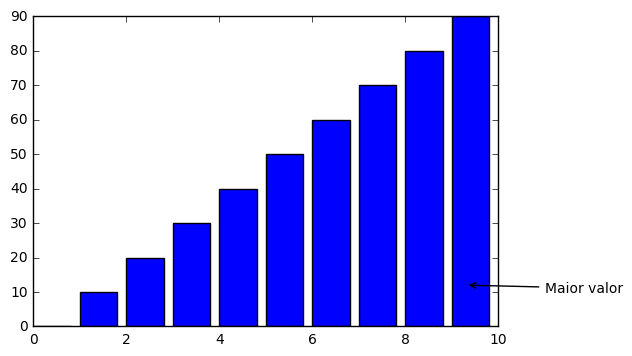
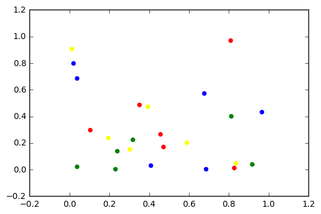
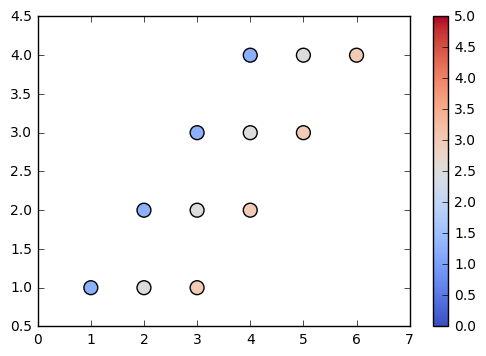

```python
#importando a biblioteca 

import matplotlib.pyplot as plt


```


```python
# Plotar imagem no jupyter

%matplotlib inline # ou  plt.show() 

#Não sei se é necessário, talvez plt.show() já resolva todo o problema


```


```python
#cores disponíveis

plt.style.available
```


    [u'seaborn-darkgrid',
     u'seaborn-notebook',
     u'classic',
     u'seaborn-ticks',
     u'grayscale',
     u'bmh',
     u'seaborn-talk',
     u'dark_background',
     u'ggplot',
     u'fivethirtyeight',
     u'seaborn-colorblind',
     u'seaborn-deep',
     u'seaborn-whitegrid',
     u'seaborn-bright',
     u'seaborn-poster',
     u'seaborn-muted',
     u'seaborn-paper',
     u'seaborn-white',
     u'seaborn-pastel',
     u'seaborn-dark',
     u'seaborn-dark-palette']


```python
# Mudar tamanho da imagem 

plt.rcParams['figure.figsize'] = (11,7)
```


```python
# Salvar figura com transparência ou não 

plt.savefig('nome_da_imagem.png'`, transparent = True)
```


```python
import matplotlib.pyplot as plt


x= range(10)
y = range(0,100,10)  # Criando variáveis

print (x,y)

plt.plot(x, y)   #Criando o plot  ou   - fig,ax = plt.subplots()
                 #                     - ax.plot(x, y)


plt.title('TITULO LINDO') #Título

plt.xlabel('Eixo X') 
plt.ylabel('Eixo Y')  # Nomes dos eixos

plt.show() # Printando o plot

```

    ([0, 1, 2, 3, 4, 5, 6, 7, 8, 9], [0, 10, 20, 30, 40, 50, 60, 70, 80, 90])
    





```python
import matplotlib.pyplot as plt


x= range(10)
y = range(0,100,10)  # Criando variáveis

# Outras formas de plotagens

plt.plot(x, y, color='green')
plt.scatter(x, y, color='red')
plt.show()


plt.plot(x, y, 'b--')
plt.scatter(x, y, marker="*", color='red')
plt.show()


```








```python
import matplotlib.pyplot as plt

#Anotações


x= range(10)
y = range(0,100,10)  # Criando variáveis
fig, ax = plt.subplots()
ax.bar(x, y)
ax.annotate("Maior valor", 
            xy=(9.3, 12),
            xycoords='data',
            xytext=(11, 10),
            textcoords='data',
            arrowprops=dict(arrowstyle="->",connectionstyle="arc3"))
plt.show()
```





```python
import matplotlib.pyplot as plt
import numpy as np

x1= np.random.rand(3,2)
x2= np.random.rand(3,2)    #Criando variáveis aleatórias
x3= np.random.rand(3,2)
x4= np.random.rand(3,2)

y1= np.random.rand(3,2)
y2= np.random.rand(3,2)    #Criando variáveis aleatórias
y3= np.random.rand(3,2)
y4= np.random.rand(3,2)


plt.scatter(x1,y1,color='red')
plt.scatter(x2,y2,color='blue')
plt.scatter(x3,y3,color='yellow')
plt.scatter(x4,y4,color='green')
plt.show()
```





```python
import matplotlib.pyplot as plt

jet=plt.get_cmap('coolwarm')

x = [1,2,3,4]
y = [1,2,3,4]
z = [1,1,1,1]

a = [2,3,4,5]
b = [1,2,3,4]
c = [2,2,2,2]

d = [3,4,5,6]
e = [1,2,3,4]
f = [3,3,3,3]

plt.scatter(x, y, s=100, c=z, cmap=jet, vmin=0, vmax=4)
plt.scatter(a, b, s=100, c=c, cmap=jet, vmin=0, vmax=4)
plt.scatter(d, e, s=100, c=f, cmap=jet, vmin=0, vmax=4)

plt.clim(0,5)
plt.colorbar()
plt.show()
```





```python

```
